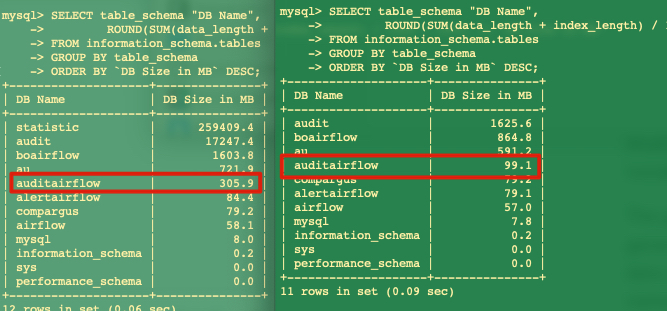

# mysql
everything about mysql


# setup
```bash
# pull
$ docker pull mysql:5.7


# run
# $ docker run --platform linux/x86_64 \
# --name mysql_container \
# -e MYSQL_ROOT_PASSWORD=admin \
# -d -p 3307:3306 \
# -v /Users/runzhou/space/data/mysqlconf:/etc/mysql/conf.d \
# -v /Users/runzhou/space/data/mysqldata:/var/lib/mysql mysql:latest --explicit-defaults-for-timestamp=1


$ docker run \
--name mysql_container \
-e MYSQL_ROOT_PASSWORD=admin \
-d -p 3307:3306 \
-v /Users/runzhou/space/data/mysqlconf:/etc/mysql/conf.d \
-v /Users/runzhou/space/data/mysqldata:/var/lib/mysql mysql:latest

# connect
$ mysql -h127.0.0.1 -uroot -padmin --port=3307


# docker.cnf
[mysqld]
skip-host-cache
skip-name-resolve

# mysql.cnf
[mysql]

[mysqld]
max_connections=512
explicit_defaults_for_timestamp=0
lower_case_table_names=1

# mysqldump.cnf
[mysqldump]
quick
quote-names
max_allowed_packet = 16M

############################################ download mysql backup start ############################################
# (1) backup from devcos
$ docker exec 183bb56cdc56 /usr/bin/mysqldump -u root --password=admin test > backup.sql

# (2) download
$ scp -r runzhou@10.176.8.119:/x/home/runzhou/mysql_bkup/backup.sql /Users/runzhou/git/argus/gcp_migration/dev52-test-apps-argus/10.176.8.119_web

# (3) upload
$ scp -r /Users/runzhou/git/argus/gcp_migration/dev52-test-apps-argus/10.176.8.119_web/backup.sql runzhou@10.183.162.86:/home/runzhou/mysql_bkup
$ chwon root:root backup.sql

# (4) import data to dev52
# (4.1) create database;
$ mysql -h127.0.0.1 -uroot -padmin
# with differnt port
# https://dev.mysql.com/doc/refman/8.0/en/connecting.html

$ create database test;


# (4.2) import
# (4.2.1) import via docker cmd
$ docker exec -i a22012cd1da3 mysql -uroot -padmin test < /home/runzhou/mysql_bkup/backup.sql

# (4.2.2) import via mysql client
$ mysql -h127.0.0.1 -uroot -padmin test < /home/runzhou/mysql_bkup/backup.sql


# drop database
$ drop database test;

# into container
$ docker exec -it a22012cd1da3 bash


############################################ download mysql backup end ############################################

```

```sql
-- only mysql8+ supported
-- Recursive create https://dev.mysql.com/doc/refman/8.0/en/with.html#common-table-expressions-recursive
-- need execute below in non-strict mode
WITH RECURSIVE cte (n) AS
(
  SELECT 1
  UNION ALL
  SELECT n + 1 FROM cte WHERE n < 5
);

SELECT * FROM cte;

$ mysql -h127.0.0.1 --port=3307 -uroot -padmin -e "SELECT @@GLOBAL.sql_mode;"

-- default mode
-- ONLY_FULL_GROUP_BY,STRICT_TRANS_TABLES,NO_ZERO_IN_DATE,NO_ZERO_DATE,ERROR_FOR_DIVISION_BY_ZERO,NO_ENGINE_SUBSTITUTION

-- set as non-strict mode
$ mysql -h127.0.0.1 --port=3307 -uroot -padmin -e "SET GLOBAL sql_mode = ’NO_ENGINE_SUBSTITUTION’;"

-- reset
$ mysql -h127.0.0.1 --port=3307 -uroot -padmin -e "SET GLOBAL sql_mode = 'ONLY_FULL_GROUP_BY,STRICT_TRANS_TABLES,NO_ZERO_IN_DATE,NO_ZERO_DATE,ERROR_FOR_DIVISION_BY_ZERO,NO_ENGINE_SUBSTITUTION’;"

$ mysql -h127.0.0.1 -uroot -padmin --port=3307

```


# Issue
## 1. backup in new mysql server schema size is different 

1. ref_1<br>
3:1  shrinkage<br>



- https://dba.stackexchange.com/q/189229
> Remember, a database has to store indexes, your dump might only have to store their definition!

- https://dba.stackexchange.com/a/189572
> INDEXES are not dumped


```mysql
$ SHOW TABLE STATUS FROM auditairflow;
```


- how to optimize MySQL tables
https://phoenixnap.com/kb/mysql-optimize-table#ftoc-heading-1


2. ref_2<br>
https://dba.stackexchange.com/questions/279997/why-does-mysqldump-restore-to-a-smaller-size

`ANALYZE` - recomputes the statistics

`OPTIMIZE` rebuilds the table

- https://dba.stackexchange.com/a/279999/276223
eliminate "empty" reserved space


## 2. mysqldump: Error 1053
```log
mysqldump: Error 1053: Server shutdown in progress when dumping table `MAR_SELF_DETECTION_RESULT` at row: 94015349
```
- https://stackoverflow.com/a/21564716/7163137


# Mysql

## 1. row_number() sample
```sql
DROP TABLE PP_SCRATCH.sample;


CREATE TABLE PP_SCRATCH.sample AS
(
SELECT B.CUST_ID,
  CASE WHEN B.CUST_ACCT_TYPE_CODE =  0 THEN 'PERSONAL' ELSE 'PREMIER' END AS CUSTOMER_TYPE,
  CASE WHEN (ZEROIFNULL(MBR_NTPV_12_MTH_SENT_CNT)  + ZEROIFNULL(NTPV_12_MTH_RECV_CNT)) > 0 THEN 'ACTIVE'
    ELSE  'INACTIVE' 
  END AS ACTIVE_STATUS                  
FROM PP_ENGINEERING_VIEWS.DIM_CUST B 
LEFT JOIN PP_DISCOVERY_VIEWS.AGG_CUST_PROFILE_MTH A ON A.CUST_ID=B.CUST_ID 
  QUALIFY ROW_NUMBER() OVER(PARTITION BY B.CUST_ID ORDER BY B.WUSER_SRC_ROW_UPD_TS)=1
WHERE MTH_ID=1445
  AND B.GUEST_WAX_USER_Y_N ='N'
  AND B.GUEST_DCC_USER_Y_N ='N'
  AND B.ACCT_CLSD_Y_N = 'N'
  AND B.PRMRY_RESIDE_CNTRY_CODE = 'AU'
  AND B.CUST_ACCT_TYPE_CODE in (0,1)
  AND B.ACCT_CRE_DT < '2020-03-09'
  AND B.CUST_LEGAL_ENTITY_CODE='S'
  AND B.PRMRY_EMAIL_ADDR NOT LIKE '%PAYMENTS_NOREPLY+%_%@ETSY.COM%'
) PRIMARY INDEX (CUST_ID);
```

## 2. choose schema from notebooks for oracle db
```sql
%%oracle -db COMP -ct true

```


## 3. common combo
```sql
-- show schema
show databases;

-- show tables
show tables;

```

## 4. select table
## 5. drop table
## 6. update table
## 7. delete table records


<br><br><br><br><br><br>

# sqlalchemy

## 1. text column cannot display all result
```python
sql = "select * from query where detection_id = 878 and detection_order = 0 and status = 0;"
print(sql)
rs = engine.execute(sql)
# rs.fetchall()
with open('out.txt', 'w') as f:
    for record in rs.fetchall():
        print(record.content, file=f)
#     print(rs.fetchall(), file=f)  # Python 3.x
```

## 2. connect to a database
```python
# connect
import sqlalchemy
import pandas as pd
from datetime import datetime
import pytz
engine=sqlalchemy.create_engine("mysql+mysqlconnector://<userid>:%s@10.47.160.56:<port>/<schema>" % '<password>')

# query
sql = "select * from schema.table"
print(sql)
rs = engine.execute(sql)
rs.fetchall()

# disconnect 
engine.dispose()


```


<br><br><br><br><br><br>

# Teradata

## 1. extract hour from int timestamp
```sql
SELECT COUNT(1) 
FROM `schema`.`table` 
WHERE `col1` = 520 
  AND HOUR(FROM_UNIXTIME(int_timestamp)) = 6 
  AND ID >= 1125096496;

```

## 2. show columns type
```sql
-- https://stackoverflow.com/a/29527148/7163137
HELP COLUMN PP_SCRATCH.DK_UPDATED_20220810.*
```

## 3. update value
```sql
UPDATE `schema`.`table` 
SET `col1` = `col1` + 10800 
WHERE `col2` = 520 
  AND HOUR(FROM_UNIXTIME(`col3`)) = 6 
  AND `ID` > 1125096496;
```

## 4. delete records 
```sql
DELETE FROM schema.table  
WHERE ACCOUNT_NUMBER IN (
  SELECT  CUST_ID FROM
  A,
  B,
  C
  WHERE
    A.AM_ID=B.ACCT_MGR_ID
  AND UPPER(A.NAME) = 'HAHA'
  AND (B.FLAG1/1) MOD 2 = 0
  AND (B.FLAG1/2) MOD 2 = 1
  AND  CAST(C.CUST_ID AS NUMBER)  = A.ACCOUNT_NUMBER
);
```

## 5. drop table
```sql
DROP TABLE IF EXISTS schema.table;
```

## 6. select table
```sql
select top 10 * from schema.table;
```


## 7. count numbers
```sql
SELECT COUNT(*) AS COUNT_NUM 
FROM schema.table
```